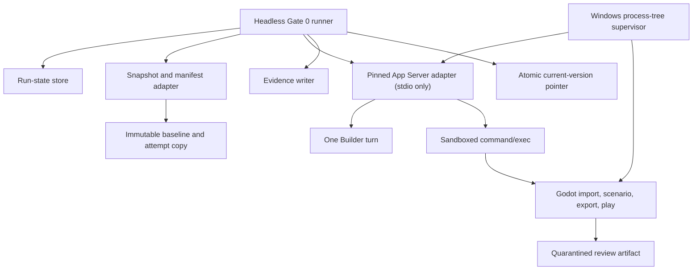

# AI Game Studio — Critical Technical Response and Gate 0 Feasibility Design

**Date:** 2026-07-16  
**Status:** Updated architecture review and feasibility design; Gate 0 authorization recommendation only  
**Input reviewed:** `E:\downloads_new\AI_Game_Studio_Initial_Product_and_MVP_Plan.md`  
**Recommendation:** **Authorize the revised Gate 0 only.** Product implementation and Milestone 1 remain blocked until every hard Gate 0 criterion passes.

---

## 1. Executive verdict

The product thesis is credible: a bounded, sequential studio loop can add value without recreating GameHelm. The proposed implementation is not yet safe or evidenced enough to begin the full product.

The plan is strongest where it limits product scope. It is weakest where it assumes that owning a command makes execution safe, that App Server restart implies assignment recovery, and that terminating a parent process controls its descendants on Windows.

The most important correction is:

> **Codex is not the only untrusted execution boundary. A model-edited Godot project and its exported review build are also untrusted programs.**

Godot projects can run editor code through `@tool`, load native libraries through GDExtension, access files, use the network, and spawn processes. Godot's official documentation explicitly describes these capabilities. Therefore, importing, testing, exporting, or playing AI-written project code outside an enforced sandbox is not acceptable for the intended nontechnical user. A closed command allowlist prevents arbitrary command selection; it does not contain what the selected executable does after launch.

The second correction is:

> **App Server persistence is not documented as exactly-once recovery for an in-flight Builder assignment.**

Current official App Server documentation confirms stored threads, `thread/read`, `thread/resume`, runtime status, interruption, authentication, approvals, stable versus experimental API gating, and version-specific generated schemas. It does not promise that a turn survives an App Server process crash, that `thread/start` or `turn/start` is idempotent, or that a client can safely replay a request whose response was lost.

The third correction is:

> **Electron is a suitable application shell, not a recovery mechanism or process-containment boundary.**

Electron is inherently multi-process. Its renderer sandbox is unrelated to the Codex Windows sandbox. Node/Electron child termination does not by itself prove that grandchildren are gone. Windows Job Objects can manage a process tree and support kill-on-close behavior, but that behavior must be integrated and fault-tested.

### Decision in one sentence

Proceed with a smaller, headless Gate 0 that proves a pinned App Server subset, isolated authentication, Builder write containment, sandboxed Godot execution, sandboxed interactive play, crash-safe process-tree cleanup, conservative reconciliation, and an immutable current-version invariant.

### Technical coherence of the clarified MVP

The clarified MVP is technically coherent as a constrained product hypothesis.

Its coherence comes from five boundaries that must remain non-negotiable:

1. the application creates projects from a trusted starter rather than importing arbitrary Godot projects;
2. only one logical role and one cycle run at a time;
3. only the Builder receives write access, and only to an isolated attempt;
4. the application—not role output—selects and runs the build/check/export procedures;
5. only the human can select the current version.

Those boundaries make a packaged desktop workflow plausible without a daemon, database, custom MCP server, generic workflow engine, parallel writers, or GameHelm-style authority model.

The coherence is conditional on Gate 0 proving the two boundaries that cannot be established by architecture prose: Windows execution containment and conservative crash reconciliation. In particular, the MVP is not technically coherent if it launches model-generated native executables without an effective sandbox or silently retries ambiguous Builder work.

### Three-horizon product boundary

| Horizon | Purpose | Included | Explicitly excluded | Authorization condition |
|---|---|---|---|---|
| **Gate 0** | Headless feasibility and safety experiment | One trusted fixture, one fixed Builder assignment, pinned App Server, isolated auth, exact checks/export, native and Web review-runtime probes, fault injection, evidence packet | Product UI, Producer/Designer/Reviewer turns, feedback loop, creative quality, general project support | Authorized only as described in this document. It must not grow into the product. |
| **Exact MVP** | Packaged desktop application for one complete creator loop | Game Brief and plan approval; sequential Producer, Designer, Builder, Reviewer; two playable review builds separated by confirmed human feedback; Studio/Plan/Builds UI; bounded recovery and current-version selection | Arbitrary existing projects, parallel writers, publishing, cloud collaboration, asset generation, multiple engines, generic infrastructure | Authorized only after every hard Gate 0 criterion passes and the owner accepts the evidence packet. |
| **Later capabilities** | Expansion after independent MVP evidence | More templates and genres, richer playtest evidence, accessibility specialization, mobile review, collaboration, controlled parallelism, asset-generation experiments, existing-project research | Anything not supported by demonstrated user need and a new threat/scope review | Separate authorization after MVP usability and safety acceptance. |

Gate 0 is not an early version of the product. It has no obligation to look like the product, and product UX work provides no evidence for Gate 0's core uncertainties.

### Exact MVP normal path

The exact MVP must complete this path without requiring the creator to open Codex, Git, a terminal, or the Godot editor:

1. The creator describes a small game in ordinary language.
2. The application proposes a concise Game Brief and first-phase plan.
3. The creator edits or explicitly approves them.
4. The Producer proposes one bounded cycle.
5. The Designer converts the proposal into an implementation brief with inclusions, exclusions, acceptance scenarios, and protected behavior.
6. The Builder edits an isolated working version through one Codex turn.
7. The application validates scope and runs its closed Godot import, scene, test, scenario, evidence, and export pipeline.
8. The Reviewer inspects the exact candidate, brief, deterministic results, and available runtime evidence.
9. The checkpoint separates player-visible change, deterministic checks, runtime observations, Reviewer assessment, remaining human judgment, recommendation, and non-effect.
10. The creator plays the safely contained review build.
11. The creator gives ordinary-language feedback.
12. The application shows its interpretation, and the creator edits or confirms it.
13. A second bounded Producer/Designer/Builder/check/Reviewer cycle creates a visibly changed review build.
14. The creator plays the second build.
15. The creator chooses to make it current, continue, change direction, or pause.
16. Failed, interrupted, unsafe, out-of-plan, or ambiguous attempts leave the current version unchanged.

The application may display a four-person studio, but these are sequential assignments over one supervised integration. No simultaneous App Server processes or parallel writing agents are required.

### Exact MVP product surface

- **Studio** — game identity, player promise, phase, cycle goal, active logical role, meaningful progress, latest playable build, human-needed state, and a prominent Stop action.
- **Plan** — player promise, core loop, audience, tone, visual direction, phase objective, included scope, explicit exclusions, and completion criteria.
- **Builds** — screenshot-led version history with plain-language summaries and working/review/current status; no Git vocabulary.
- **Checkpoint** — the core decision surface, with no meaningful option selected by default and no generic Accept action.

The renderer must not expose Agents, Tasks, Git, Sessions, Context, Claims, Logs, or Protocol as primary product sections. Technical detail may exist behind progressive disclosure.

The checkpoint must visibly separate:

- what changed for the player;
- what was deterministically checked;
- what was observed at runtime;
- what the AI Reviewer assessed;
- what still requires human judgment;
- the studio's recommendation;
- what the recommendation does not mean.

Primary actions use exact consequences: **Play build**, **Continue with this recommendation**, **Give different direction**, **Make this the current version**, and **Pause**.

### Exact MVP supported project boundary

- Godot 4 and GDScript only;
- 2D, single player, offline;
- one application-created game open at a time;
- one small core loop and one short level/scenario;
- one review runtime selected by Gate 0: contained native or contained Web;
- one trusted starter project controlled by the application;
- curated/placeholder assets and narrowly allowlisted passive user assets;
- no arbitrary existing-project import.

The application owns the starter, export presets, test harness, scripted scenario interface, protected files, and build command grammar. The Builder cannot replace or redefine these foundations during the MVP.

### Exact MVP role and authority boundary

| Role | Workspace authority | Required output | May not do |
|---|---|---|---|
| Producer | Read accepted project memory and evidence | One bounded cycle proposal | Edit code, change the constitution, start another cycle automatically, or select current |
| Designer | Read project memory and proposal | Precise implementation brief with inclusions, exclusions, acceptance/regression scenarios, and protected areas | Edit code, broaden the phase, or claim fun |
| Builder | Write only inside the isolated working attempt | Builder report describing completed/incomplete work and known problems | Supply executable/build commands for the app, change protected foundations, declare checks passed, or select current |
| Reviewer / Playtest Analyst | Read-only access to the exact candidate, brief, check results, and prepared evidence | Attributed assessment separating evidence from inference | Edit the candidate, convert opinion into proof, claim objective fun, or accept for the human |

Only one role turn may be active. The MVP may reuse one supervised App Server child, but every role assignment starts a fresh thread with explicit role instructions and the minimum prepared context. Producer, Designer, and Reviewer are read-only. Builder alone receives exact workspace-write authority.

### Exact MVP build ownership and version model

The application owns closed, predefined operations for:

- project import/validation;
- required scene loading;
- configured tests and scripted scenarios;
- log, metric, and screenshot collection;
- review-build export;
- contained launch and Stop behavior.

Codex output is data to validate, never a source of arbitrary executables, shell strings, commands, output paths, or build procedures.

The user-facing version model is:

- **Working build** — mutable internal experiment in the active attempt;
- **Review build** — immutable candidate that passed mandatory identity, scope, containment, check, export, and launch eligibility requirements and is ready for human play;
- **Current version** — an eligible review build explicitly selected by the human.

Failed, interrupted, unsafe, out-of-scope, tampered, or ambiguous attempts remain preserved as recovery evidence but cannot become review builds or current versions.

### Exact MVP limits

- one active role and one active cycle;
- a maximum duration and no-progress timeout per role;
- a maximum cumulative duration per cycle;
- bounded transport retries only for documented replay-safe operations;
- repeated-failure detection and terminal failure state;
- one completed production cycle per human checkpoint;
- at most three human-authorized improvement cycles before an explicit phase-level decision;
- prominent Stop throughout active work;
- no automatic new phase;
- no indefinite retry after authentication, capacity, process, containment, or build failure.

### Exact MVP recovery contract

For Codex exit, application restart, Godot failure, test failure, partial Builder work, unexpected changed paths, or an ambiguous external effect, the product must always answer:

1. What happened?
2. Are the project files safe?
3. Did the current version change?
4. What can happen next?

The default invariant is that the current version did not change. Any exception must be proven from a complete checksummed promotion record. Unknown non-idempotent effects are inspected and reconciled; they are never replayed blindly.

### Remaining disagreement and required removals

The clarified direction resolves most scope ambiguity. Four corrections remain:

1. **Remove “up to three automated improvement cycles before a human checkpoint.”** The stated product requires the creator to play and judge each review build. Therefore, every completed production cycle ends at a human checkpoint. The phase may allow at most three **human-authorized** improvement cycles before requiring an explicit continue-phase, redirect, pause, or finish decision. Internal transport retries are not creative cycles and have separate limits.
2. **Narrow “user-supplied assets.”** The MVP may accept only size-limited, allowlisted passive formats that are copied or normalized by the application. It must reject Godot scenes/resources, scripts, addons, archives, executables, native libraries, fonts with unbounded risk until separately assessed, and any reparse-point path. Curated starter assets remain the default.
3. **An unsafe build cannot be selected even by the human.** Human authority chooses among eligible review builds; it does not override failed containment, failed mandatory checks, artifact tampering, or unknown identity. “Make this the current version” must be unavailable with a plain-language explanation when eligibility fails.
4. **Runtime evidence is not automated play acceptance.** Screenshots, scripted checkpoints, metrics, and logs can support the Reviewer, but the Reviewer must label inferences and must never claim objective fun, charm, or creative acceptance.

No other major product element should be removed. The three-section UI, sequential logical roles, two-build feedback loop, build/current distinction, limits, and recovery language are proportionate to the intended MVP.

---

## 2. Evidence vocabulary

This document uses four labels:

- **Confirmed:** Current first-party documentation or generated protocol definitions explicitly support the claim.
- **Observed locally:** Verified on the target workstation on 2026-07-16; this may drift.
- **Hypothesis to test:** Plausible, but not promised by current documentation or not yet demonstrated on the target workstation.
- **Rejected assumption:** The proposal is too strong or false without an additional constraint.

---

## 3. Current target-workstation observations

These observations are useful preflight evidence, not a Gate 0 pass:

| Item | Observed value | Implication |
|---|---|---|
| Operating system | Windows 11 Pro 64-bit, build 26200 | Meets the current recommended Windows family for native Codex sandboxing. |
| Workspace volume | `E:` fixed NTFS, healthy | Suitable for same-volume staging and atomic-pointer experiments. Cross-volume behavior remains out of scope. |
| Codex | `codex-cli 0.143.0` | Installed version is behind the registry result observed today (`0.144.5`); PATH discovery cannot be treated as a supported-version policy. |
| App Server CLI | Present; command and schema generators label themselves experimental | Core documented APIs may be used only behind exact version pinning and an allowlist. |
| Codex authentication | Logged in using ChatGPT | Proves only the existing global installation. It does not prove isolated application-managed login or restart persistence. |
| Node.js | `22.22.2` | Adequate for a headless TypeScript Gate 0 runner. |
| Godot | `4.7.stable.official.5b4e0cb0f` | Exact engine version must be recorded in evidence and pinned for the fixture. |
| Godot export templates | Matching `4.7.stable` Windows debug template found | Removes one local preflight blocker; missing-template behavior still requires a negative test. |
| Git | `2.49.0.windows.1` | Available, but Gate 0 does not need Git for snapshots. |
| Repository | Empty at review start | No existing implementation or repository conventions need preservation. |

An isolated experiment generated TypeScript protocol definitions from the installed Codex binary. It confirmed stable type shapes for `thread/start`, `turn/start`, precise `SandboxPolicy`, `outputSchema`, `clientUserMessageId`, thread runtime status, and turn statuses. It did **not** establish request idempotency or process-crash continuation.

---

## 4. Current official capability findings

### 4.1 Codex App Server

**Confirmed:** Official documentation describes App Server as the deep-integration interface for authentication, conversation history, approvals, and streamed events. The default transport is JSONL over stdio; the connection requires `initialize` followed by `initialized`; version-specific TypeScript and JSON Schema output can be generated. See [Codex App Server](https://learn.chatgpt.com/docs/app-server).

**Confirmed:** The documented API has a stable surface and an explicit `experimentalApi` opt-in for experimental methods and fields. Gate 0 must not opt in.

**Confirmed:** App Server exposes managed ChatGPT browser and device-code login, API-key login, account state, logout, and authentication notifications. It also documents credential storage in the OS keyring or `auth.json` under `CODEX_HOME`. See [Authentication](https://learn.chatgpt.com/docs/auth#credential-storage) and [Codex config/state locations](https://learn.chatgpt.com/docs/config-file/config-advanced#config-and-state-locations).

**Confirmed:** `thread/read` can inspect a stored thread without resuming it, and statuses include `notLoaded`, `idle`, `systemError`, and `active`. Turn statuses include `inProgress`, `completed`, `interrupted`, and `failed`.

**Confirmed:** `command/exec` can run an exact command under the server sandbox without starting an agent turn. This is the smallest way for the application—not the model—to own Godot argument vectors while still applying the Codex Windows sandbox.

**Constraint:** The CLI reference says `codex app-server` is primarily for development/debugging and may change without notice, while the App Server guide presents a stable API subset for integrations. See [Codex developer commands](https://learn.chatgpt.com/docs/developer-commands#codex-app-server). This is not a reason to abandon it; it is a reason to pin the exact binary, generate matching types, avoid experimental APIs, and fail closed on incompatibility.

**Unsupported:** No official promise was found for exactly-once `thread/start` or `turn/start`, automatic continuation after App Server process death, or safe replay after a lost response.

### 4.2 Codex authentication and configuration

**Confirmed:** A separate `CODEX_HOME` separates configuration and file-based state. Credentials may instead be stored in the OS keyring. Project-local config is loaded only for trusted projects, and some machine/auth settings cannot be overridden from project config.

**Hypothesis to test:** `CODEX_HOME` plus keyring storage provides the desired isolation and reliable restart behavior on this Windows installation. Keyring namespace and fallback behavior must be observed rather than assumed.

**Rejected assumption:** “Application-managed Codex home” is not a free simplification. It makes the application responsible for login UX, credential-store selection, upgrades, state migration, and secret redaction. Gate 0 must prove that boundary before it is adopted.

### 4.3 Windows Codex sandbox

**Confirmed:** The current native Windows sandbox has `elevated` and `unelevated` implementations. `elevated` is preferred and uses dedicated lower-privilege users, filesystem permissions, firewall rules, and policy changes. It can be blocked by UAC choices or enterprise policy. `unelevated` is explicitly weaker. See [Codex Windows sandbox](https://learn.chatgpt.com/docs/windows/windows-sandbox#windows-sandbox).

**Confirmed:** `workspace-write` limits writes to configured roots and disables spawned-command network access by default. `.git`, `.codex`, and `.agents` remain protected inside writable roots. See [Agent approvals and security](https://learn.chatgpt.com/docs/agent-approvals-security#sandbox-and-approvals).

**Constraint:** Spawned-command network isolation does not mean the App Server itself is offline; App Server must communicate with OpenAI. The evidence must distinguish model-service traffic from subprocess traffic.

**Rejected assumption:** Sandbox mode names alone are not evidence. Gate 0 must use synthetic sibling-file and network sentinels to demonstrate effective enforcement on this machine.

### 4.4 Electron

**Confirmed:** Electron has one main process and separate renderer processes. Renderer access to privileged operations should cross narrow IPC through a context-isolated preload bridge. See [Electron process model](https://www.electronjs.org/docs/latest/tutorial/process-model), [context isolation](https://www.electronjs.org/docs/latest/tutorial/context-isolation), and the [Electron security checklist](https://www.electronjs.org/docs/latest/tutorial/security).

**Rejected assumption:** “Single-process Electron architecture” is inaccurate. Electron, App Server, Godot, and the review build already form several OS processes.

**Confirmed:** Electron's `utilityProcess.kill()` terminates that utility process, but its documentation does not promise descendant-tree cleanup. See [Electron utilityProcess](https://www.electronjs.org/docs/latest/api/utility-process).

**Revision:** Gate 0 should not depend on Electron or React. A headless TypeScript runner isolates feasibility from UI work. If Gate 0 passes, the same pure orchestration modules can be hosted by Electron main. Add an Electron utility worker only if measured event-loop blocking or crash isolation requires it.

### 4.5 Windows process supervision

**Confirmed:** Windows Job Objects manage groups of processes as a unit. Child processes normally inherit the job, and `JOB_OBJECT_LIMIT_KILL_ON_JOB_CLOSE` terminates associated processes when the last job handle closes. Nested jobs are supported on current Windows. See [Microsoft Job Objects](https://learn.microsoft.com/en-us/windows/win32/procthread/job-objects) and [AssignProcessToJobObject](https://learn.microsoft.com/en-us/windows/win32/api/jobapi2/nf-jobapi2-assignprocesstojobobject).

**Confirmed:** Node documents that `subprocess.killed` means a signal was sent, not that termination completed; detached Windows children can outlive the parent. See [Node child processes](https://nodejs.org/api/child_process.html).

**Hypothesis to test:** App Server and every descendant it launches can be kept in one non-breakaway Job Object without conflicting with Codex's own sandbox jobs. If nested-job behavior conflicts, Gate 0 must find a narrower supported containment approach before Milestone 1.

### 4.6 Godot execution

**Confirmed:** Godot supports `--import`, `--headless`, `--script`, `--check-only`, and command-line debug/release export with an exact preset and output path. The export target directory must exist, and matching export templates are required. See [Godot command-line tutorial](https://docs.godotengine.org/en/stable/tutorials/editor/command_line_tutorial.html).

**Confirmed risk:** `@tool` scripts execute inside the editor, and Godot warns that the editor does not protect against their misuse. See [Running code in the editor](https://docs.godotengine.org/en/stable/tutorials/plugins/running_code_in_the_editor.html).

**Confirmed risk:** GDExtension loads native shared libraries at runtime. See [What is GDExtension?](https://docs.godotengine.org/en/stable/tutorials/scripting/gdextension/what_is_gdextension.html).

**Confirmed risk:** Godot's `OS` API can execute binaries and create independent processes. See [Godot OS class](https://docs.godotengine.org/en/stable/classes/class_os.html).

**Rejected assumption:** App-owned Godot command construction is sufficient containment. Godot import, test, export, and play processes require their own sandbox and process-tree controls.

---

## 5. Architectural assumption review

| Proposed assumption | Assessment | Required revision or test |
|---|---|---|
| Electron + React should be the first Gate 0 architecture | Unnecessary | Use a headless TypeScript runner. Add UI only after the integration and safety boundary passes. |
| Electron main can own all orchestration | Plausible for MVP, not proven | Keep modules pure and asynchronous. Measure event-loop stalls. Add a utility worker only with evidence. |
| One App Server child per application boot | Reasonable default, not a guarantee | Gate 0 uses one stdio child per run. Test restart and stale-child cleanup. Do not adopt daemon mode. |
| App Server is a stable product dependency | Partially supported | Pin exact Codex version and binary hash, generate matching schemas, use stable API only, and reject drift. |
| Fresh thread per role is sufficient isolation | Context isolation only | It does not isolate filesystem, credentials, environment variables, or process descendants. Apply explicit sandbox policy and sanitized environment. |
| Persisting a thread ID provides crash recovery | Too strong | It supports inspection/resumption, not exactly-once recovery. Persist operation intent and never blindly replay ambiguous Builder turns. |
| App Server auth can be embedded easily | Unsupported simplification | Prove fresh-home login, cancellation, device-code fallback, token persistence, logout, redaction, and enterprise-policy failure. |
| Application-managed `CODEX_HOME` is the smallest boundary | Unproven | Gate 0 compares observed keyring/file behavior. Never copy the user's global `auth.json`. |
| `workspace-write` gives Builder the intended authority | Capability exists; enforcement is environment-dependent | Use exact writable root, network off, `approvalPolicy: never`, and sentinel tests. |
| Read-only roles are safe | Incomplete | Read-only prevents writes but is not a confidentiality guarantee. Later roles should receive a narrow prepared evidence directory, not the entire user filesystem. |
| Network disabled means the whole role is offline | False | It applies to sandboxed commands. App Server still needs upstream service access. Explain and test the distinction. |
| App-owned Godot commands are safe | False | Run them under a sandbox, deny dangerous project capabilities, sanitize environment, and test external effects. |
| A headless Godot pass proves the visible game | False | Headless scenarios prove state transitions, not visual quality. Require a separate visible interactive launch and captured evidence. |
| Godot exit code zero proves a valid build | Too weak | Require expected checkpoint output, artifact existence, nonzero size, hashes, and a launch test. |
| Exporting a desktop build makes it safe to play | False | The export contains model-written code. Interactive launch containment is a hard Gate 0 requirement. |
| Parent-process termination stops the process tree | Unsupported on Node/Electron alone | Prove Job Object containment or an equivalent tested mechanism. |
| A database is needed for recovery | No | One bounded run-state record plus immutable result files is sufficient for one active run. |
| A runtime journal must be a generic subsystem | No | Use a small, versioned, checksummed operation state file. |
| Git is required for Gate 0 snapshots | No | Use full fixture copies plus SHA-256 manifests. Revisit hidden Git only after the constrained product loop works. |
| Atomic rename solves all snapshot issues | Too strong | Restrict Gate 0 to same-volume local NTFS; test crash points and file locks. |
| Static changed-file checks enforce security | False | They enforce scope after the fact. OS sandboxing is the security boundary; static checks are defense-in-depth. |
| The planned role contracts are all needed initially | No | Gate 0 needs only a fixed brief, `BuilderReport`, `CheckReport`, and `RunState`. |
| Recovery can be completed by retrying | False for Builder | Classify operations by replay safety. Unknown non-idempotent effects remain unknown until reconciled. |

---

## 6. Complexity decisions

### 6.1 Not required for Gate 0 or MVP

| Component | Gate 0 | MVP | Reason |
|---|---:|---:|---|
| Separate daemon | No | No | The product is local and foreground-bound. A daemon is justified only by background work surviving app exit or multiple independent clients, both non-goals. |
| App Server daemon mode | No | No | Stdio child ownership is simpler and has a smaller attack/recovery surface. |
| Custom MCP server | No | No | Codex already has workspace tools; Godot and snapshot actions should remain app-owned adapters, not model tools. |
| Database | No | No initially | One active operation and immutable records do not require queryable concurrent state. |
| Generic workflow engine | No | No | Use an explicit state reducer for a fixed sequence. No user-defined graphs, plugins, or arbitrary transitions. |
| Multi-agent scheduler | No | No | One role at a time remains sufficient. |
| Git worktrees | No | No initially | Full copies are adequate for a constrained fixture and small MVP-created projects. |
| Cloud services | No | No | Not needed for the local proof. |
| Product Electron/React shell | No | Yes after Gate 0 | Gate 0 tests feasibility, not product UI. A disposable BrowserWindow harness is permitted only for the named Web-runtime probe. |
| Native process helper | Evidence-gated | Evidence-gated | Add only if Job Object containment cannot be achieved safely from the chosen runtime/library. This helper is on-demand, not a daemon. |

### 6.2 Remove from Gate 0

- Producer, Designer, Reviewer, and checkpoint recommendation turns.
- Creative constitution generation and plan editing.
- Full `.studio/` project-memory hierarchy.
- Cycle counting and automated improvement loops.
- Working-build/review-build/current-version UI terminology.
- Screenshot comparison, video capture automation, and reviewer evidence synthesis.
- Git initialization, commits, branches, worktrees, or rollback UI.
- General activity normalization and progress taxonomy.
- Arbitrary project import.
- Arbitrary assets and asset generation.

Gate 0 uses one fixed brief, one Builder turn, one constrained fixture, one immutable baseline, one candidate, one check pipeline, one visible build, and one explicit current-pointer update test.

---

## 7. Revised Gate 0 objective and pass definition

### Objective

Prove on the target Windows environment that a pinned Codex App Server can perform one bounded write assignment against an isolated Godot fixture, after which application-selected Godot commands can safely import, scenario-test, export, and visibly run the candidate without changing the immutable current version or causing uncontained external effects.

### Gate 0 passes only if all are true

1. An exact Codex binary version and SHA-256 are selected; mismatches fail before work.
2. Stable, generated protocol definitions match that binary; experimental API is disabled.
3. A fresh application-managed Codex home can complete ChatGPT login, survive an App Server restart, and log out without credential leakage.
4. The Builder can write only to the attempt directory and cannot use subprocess network access.
5. Builder output conforms to a small `BuilderReport` schema.
6. Actual changed paths match the fixed brief; unexpected changes are preserved and blocked.
7. Godot import, scenario, and export run from exact argument vectors under enforced containment.
8. A model-edited Godot project cannot write a sibling sentinel, contact the test network endpoint, or leave a spawned child behind.
9. The exported review build can be played in a visible window while the same external-effect constraints remain enforced.
10. App, App Server, Godot, and review-build interruption tests leave no orphan process tree.
11. Restart reconciliation never blindly repeats an ambiguous Builder turn.
12. The current-version pointer remains unchanged for every failed, interrupted, or ambiguous attempt.
13. One successful candidate is exported, launched, played, and explicitly promoted using a crash-tested pointer update.

If item 9 cannot be achieved with acceptable interaction and containment, Milestone 1 is blocked. The next decision is either a browser-contained Godot Web preview or a dedicated review-build isolation mechanism—not unrestricted execution.

### Staged execution gates

The authorized Gate 0 runs through three internal go/no-go stages. Evidence is written continuously within each stage.

| Stage | Scope | Go condition | No-go behavior |
|---|---|---|---|
| **Gate 0A — Runtime foundation** | Pinned App Server binary and stable protocol, generated matching schemas, isolated authentication, Windows process-tree and resource supervision | Every Gate 0A hard test passes and the stage report contains no unresolved safety-critical ambiguity | Stop. Return the partial immutable evidence and recommend revising/repeating named Gate 0A probes or stopping. Do not begin Gate 0B. |
| **Gate 0B — Containment foundation** | Full-copy snapshots, crash-state mechanics, command/Builder containment, Godot import/scenario/export containment, resource-growth monitors | Every Gate 0B hard test passes; current-version invariant and containment sentinels remain intact | Stop. Return Gate 0A+0B evidence and a precise revise/repeat/stop recommendation. Do not begin Gate 0C. |
| **Gate 0C — Playable proof** | Native/Web runtime comparison, exactly one selected runtime, real Builder-to-playable result, complete fault/resource matrix, final packet | All hard gates pass and one contained runtime produces the exact playable proof | Return the immutable evidence packet and exactly one final recommendation. |

No stage failure authorizes a daemon, database, VM platform, generic workflow engine, broader permissions system, or product UI. A broader architecture requires a separate owner decision.

### Resource-exhaustion containment contract

Gate 0 uses deliberately conservative ceilings appropriate to the tiny fixture. A limit may be lowered after measurement; raising one requires an evidence note and owner-visible justification.

| Resource | Gate 0 hard limit |
|---|---:|
| Attempt source-tree files | 200 files |
| Attempt source-tree size | 64 MiB excluding app-owned transient cache/staging |
| Changed files | 20 hard resource ceiling; the fixed brief's two-path scope remains stricter |
| Individual source/config file | 1 MiB |
| Individual passive asset | 16 MiB |
| Total exported artifact set | 256 MiB |
| Individual exported file | 192 MiB |
| Per-process stdout or stderr capture | 8 MiB each |
| Per-operation log | 8 MiB |
| Total retained run logs before packet finalization | 64 MiB |
| App Server JSONL frame | 2 MiB |
| App Server events per role turn | 50,000 |
| App Server event rate | 250 events/second sustained for 5 seconds |
| App Server bytes per role turn | 64 MiB after framing, before redacted evidence compaction |
| App Server startup | 30 seconds |
| Authentication interaction | 10 minutes, never automatically retried |
| Builder turn | 15 minutes |
| Builder time without meaningful event, file change, or terminal transition | 3 minutes |
| Godot import | 2 minutes |
| Deterministic scenario | 1 minute |
| Godot export | 5 minutes |
| Godot import/scenario time without output or monitored state change | 90 seconds |
| Godot export time without output or artifact growth | 3 minutes |
| Human review session in Gate 0 | 10 minutes |
| Native protected-fixture heartbeat gap | 10 seconds |
| Web renderer `unresponsive` state | terminate if not recovered within 10 seconds |
| Graceful process-tree stop | 10 seconds, followed by forced tree termination and 5-second verification |
| App Server supervised tree committed memory | 2 GiB |
| Godot check/export supervised tree committed memory | 1 GiB |
| Native review tree or Web review renderer committed memory | 1 GiB |

Required exhaustion tests include:

- infinite and high-CPU game logic;
- excessive committed-memory allocation;
- excessive file count and disk growth inside an otherwise writable attempt root;
- oversized source files, passive assets, artifacts, logs, JSONL frames, and console streams;
- App Server event flooding by count, rate, and bytes;
- an unresponsive native review build;
- an unresponsive Web renderer.

CPU abuse is bounded by the smallest effective combination of Job Object CPU controls, wall-clock duration, and no-progress/heartbeat timeout demonstrated in Gate 0A/0B. Disk/file growth is monitored out of process at a bounded interval; the process being tested cannot report its own compliance.

On any hard-limit breach, the supervisor must:

1. persist a limit-breach record with measured value, threshold, operation identity, and last confirmed state;
2. request a bounded graceful stop when meaningful;
3. terminate and verify the relevant Job Object process tree or Web renderer/session;
4. stop consuming further unbounded output while retaining a capped prefix, capped suffix, byte counts, and SHA-256 of the full stream when it can be computed safely;
5. quarantine partial artifacts and preserve bounded evidence;
6. leave the current-version pointer unchanged;
7. mark the operation failed or ambiguous according to known evidence;
8. never replay a non-idempotent operation blindly.

### Later MVP deterministic repair turns — recorded, not implemented in Gate 0

Every playable review build returns to the human checkpoint.

A later MVP may allow a small number of deterministic repair turns inside the same cycle only when all of these are true:

- the unchanged implementation brief already declares the failed check;
- the repair addresses only a specific build, parse, test, export, or required-scenario failure;
- it introduces no creative feature, scope change, new dependency, or protected-area change;
- it uses the same isolated attempt and stricter remaining time/resource budget;
- the repair count is explicitly bounded and repeated failure terminates the cycle;
- no failed or repaired attempt becomes current without completing the normal review-build pipeline and human checkpoint.

Gate 0 does not implement repair turns. Its single real Builder assignment is never automatically followed by another Builder turn.

---

## 8. Exact Gate 0 fixture

### 8.1 Game

Use a 2D single-screen “collect one token” fixture:

- A blue square moves left and right using two input actions.
- A token sits to the right of the start position.
- Touching the token increments `collected_count` from 0 to 1.
- The baseline has deliberately weak feedback and no persistent counter label.
- No addons, C#, GDExtension, networking, save system, external assets, audio, or editor plugins.

### 8.2 Fixed Builder assignment

> Add a visible counter reading `Collected: 0/1`. Update it to `Collected: 1/1` when the token is collected and show `Complete!` beneath it. Preserve controls, collision behavior, window size, and all unrelated visuals. Modify only `scripts/hud.gd` and `scenes/main.tscn`. Do not add dependencies, plugins, native code, tool scripts, networking, file access, process execution, or new project settings.

The task is intentionally mundane. Gate 0 tests orchestration and containment, not creative quality.

### 8.3 Deterministic scenario

The fixture-owned `tests/scenario_runner.gd` must:

1. load the real main scene;
2. assert the initial counter text;
3. inject the existing right-move input for a bounded number of physics frames;
4. assert token collection and final counter text;
5. emit one machine-readable line beginning `STUDIO_SCENARIO_RESULT=`;
6. exit 0 on success and nonzero on any failed assertion or timeout.

The Builder may read but not modify the scenario runner. The app compares its hash with the baseline before executing it.

### 8.4 Project-capability restrictions

Before any Godot command, fail closed if the candidate contains:

- reparse points, symlinks, or junctions;
- `addons/`, editor plugin declarations, `@tool`, or new autoloads;
- `.gdextension`, `.dll`, `.exe`, `.so`, `.dylib`, C#, or external scripts;
- new executable file types;
- changes outside the two allowed paths;
- changed fixture test files, export preset, or `project.godot`;
- any unexpected absolute path reference.

Text scans for `OS.execute`, `OS.create_process`, `OS.shell_open`, networking, and unrestricted file access are required defense-in-depth. They are not the security boundary and cannot replace the runtime sandbox test.

---

## 9. Smallest Gate 0 architecture



### 9.1 Execution sequence

The experiment is divided into named probes. A probe may create disposable code only for its named uncertainty, and its result must be included in the evidence packet.

#### Phase 0 — Freeze inputs and invariants

1. Copy the approved fixture and fixed Builder brief into the Gate 0 source tree.
2. Record the immutable baseline manifest and initial current-version pointer.
3. Fix the supported Windows build, local NTFS requirement, Godot version, export presets, Codex version-selection rule, timeouts, and output locations.
4. Define synthetic sibling-file, network-listener, child-process-heartbeat, and reparse-point sentinels. Never use real user data as a security probe.

#### Probe A — Protocol and version compatibility

5. Select one exact Codex binary; record its path, version, and SHA-256.
6. Generate stable TypeScript and JSON schemas from that exact binary without `--experimental`.
7. Start App Server over stdio, perform `initialize`/`initialized`, and exercise only the Gate 0 allowlist.
8. Substitute an incompatible binary/schema pair and prove the runner fails before creating an attempt.

**Uncertainty resolved:** whether one pinned stable App Server subset is usable and detectable on the target machine.

#### Probe B — Authentication isolation

9. Start from an empty application-managed `CODEX_HOME` and verify `account/read` reports the unauthenticated state.
10. Start and cancel managed browser login; verify cancellation and redaction.
11. Complete managed browser login. If the loopback callback is unavailable, complete device-code login as the documented fallback.
12. Restart App Server and prove authentication persists in the managed home.
13. Record whether credentials used the Windows keyring or file fallback without reading or copying token contents.
14. Log out, restart, and prove the global Codex login was not modified.

**Uncertainty resolved:** whether the MVP can own a separate, recoverable sign-in experience without leaking or borrowing global credentials.

#### Probe C — Windows process-tree supervision

15. Launch a controlled parent that launches a grandchild heartbeat process through the proposed supervisor.
16. Exercise graceful stop, timeout escalation, parent crash, runner crash, and restart cleanup.
17. Prove that every descendant exits within the bound and that restart never kills an unrelated process based only on a stale PID.
18. Repeat with App Server launching a sandboxed child command to detect nested-Job-Object conflicts.

**Uncertainty resolved:** whether App Server, Godot, and their descendants can be bounded without a daemon.

#### Probe D — Snapshot and crash-state mechanics

19. Create baseline, attempt, candidate, staging, and current-pointer records on the same NTFS volume.
20. Inject crashes before and after every pointer/state replacement.
21. Prove recovery chooses only complete checksummed generations and never changes current on failure.
22. Add a junction/reparse point and prove no-follow traversal rejects it.

**Uncertainty resolved:** whether full-copy snapshots and a tiny state record are sufficient without Git or a database.

#### Probe E — Builder and command sandbox

23. Use `command/exec` with the exact proposed Builder sandbox to test sibling-file writes, local/public network attempts, environment leakage, and escalation handling without consuming an extra model turn.
24. Require exact attempt-root writes, network off, and `approvalPolicy: "never"`; any unexpected approval is declined and fails the probe.

**Uncertainty resolved:** whether the selected Windows sandbox policy is effective on this machine before a paid/non-idempotent Builder assignment begins.

#### Probe F — Godot pipeline containment

25. Use a disposable hostile variant of the trusted fixture whose test code attempts the synthetic sibling write, network connections, and child heartbeat.
26. Run app-selected import, scenario, and export argument arrays through the sandboxed command runner.
27. Prove the pipeline remains functional while every external sentinel remains unchanged and no descendant survives.
28. Prove invalid script, failed scenario, missing template, invalid preset, timeout, and partial export produce no eligible review build.

**Uncertainty resolved:** whether app-owned Godot operations are contained rather than merely allowlisted.

#### Probe G — Native review runtime

29. Export the hostile fixture as a Windows debug review build.
30. Attempt a visible, interactive launch under the native containment design, including input, audio if present, screenshot/log capture, Stop, crash, and restart cleanup.
31. Repeat the file/network/process sentinel checks from inside the exported build.
32. Record whether visibility requires weakening private-desktop or filesystem/network controls.

**Uncertainty resolved:** whether a native review build can be both usable and contained.

#### Probe H — Web review runtime

33. Export the same fixture with the application-owned single-threaded Godot Web preset and extensions disabled. Godot documents single-threaded Web export as the compatible default for current Godot 4 releases. See [Exporting for the Web](https://docs.godotengine.org/en/stable/tutorials/export/exporting_for_web.html).
34. Use a minimal disposable Electron BrowserWindow harness—not the product UI—with renderer sandboxing, no Node integration, context isolation, a restrictive CSP, isolated session, blocked navigation/window creation, blocked external network, no permissions, and no privileged preload bridge.
35. Serve only the generated trusted shell/engine files and candidate pack from a run-specific local origin or custom protocol. The Builder cannot supply HTML, JavaScript, URLs, headers, or server behavior.
36. Exercise input, resize, audio if present, screenshot/log capture, Stop, crash, session cleanup, and all feasible network/navigation/storage sentinels.

**Uncertainty resolved:** whether a browser-contained review can preserve the constrained 2D experience with a smaller execution trust boundary.

#### Phase 1 — Select the review runtime

37. Apply the criteria in section 9.6 to both probe reports.
38. Select native, select Web, or stop. Do not carry both runtime paths into the MVP merely because both can be made to work.

#### Phase 2 — One real Builder-to-playable proof

39. Initialize `RunState` with a new run ID and `currentVersionBefore`.
40. Copy the pristine fixture to an isolated attempt and verify its initial manifest.
41. Start one fresh Builder thread and one turn with the fixed brief, exact sandbox, and `BuilderReport` output schema.
42. Persist request, thread, and turn identifiers as soon as each becomes known.
43. Advance only after the exact turn reaches terminal `completed` status with schema-valid output.
44. Compute the actual manifest; preserve but block any path or capability deviation.
45. Freeze and hash the candidate.
46. Run import, scenario, export, artifact validation, and the selected contained review launch.
47. Capture a visible proof that the counter and completion message changed as required.
48. Explicitly promote the eligible candidate and prove the current pointer changes only at that step.

#### Phase 3 — Fault matrix and final decision

49. Run every negative, interruption, restart, and ambiguous-outcome test in section 13 against the integrated path.
50. Re-run the successful path after restart to detect state leakage.
51. Assemble the evidence packet, including failed probes and unavailable evidence.
52. Produce exactly one recommendation: authorize Milestone 1, revise and repeat named probes, or stop/change direction.

### 9.2 App Server policy

- Transport: stdio JSONL only.
- Version: one exact supported version, binary hash recorded.
- Generated schema: produced by that binary and committed with its version.
- Capabilities: no `experimentalApi`.
- Method allowlist: `initialize`, `initialized`, `account/read`, approved login/logout methods, `thread/start`, `turn/start`, `turn/interrupt`, `thread/read`, `thread/resume`, and `command/exec` lifecycle methods only.
- Unknown response field: tolerated only where generated types allow it.
- Unknown method, unexpected server request, malformed JSON, or invalid sequence: fail closed and preserve state.
- Builder: `approvalPolicy: "never"`; any approval request is declined and marks the run failed.
- Builder sandbox: exact attempt root, network false.
- Web search, apps/connectors, MCP servers, plugins, hooks, goals, memories, and multi-agent features: absent or disabled for Gate 0.

### 9.3 Minimal Codex home policy

Use a dedicated Gate 0 data directory, not the user's global Codex home:

- `CODEX_HOME=<gate0-data>/codex-home`
- default sandbox read-only;
- Windows sandbox `elevated` required for the main proof;
- web search disabled;
- credential store `auto` for the first auth experiment;
- no project-local `.codex` configuration;
- no copied global config, auth, skills, plugins, MCP configuration, history, or rules.

If `auto` falls back to file storage, record that fact without recording token contents, apply user-only ACLs, and include the risk in the evidence packet. A file token store is not automatically disqualifying for a local MVP, but it is a conscious security responsibility.

### 9.4 Godot command policy

The application constructs argument arrays; no shell strings are accepted from Codex output.

Conceptual commands:

```text
godot --headless --path <candidate> --import --log-file <unique-log>
godot --headless --path <candidate> --script res://tests/scenario_runner.gd --log-file <unique-log>
godot --headless --path <candidate> --export-debug "Windows Desktop" <unique-staging>/game.exe --log-file <unique-log>
<unique-staging>/game.exe
```

Every path is resolved, checked to be inside an expected root, and passed as a distinct argument. The environment is reduced to an allowlist. `TEMP`, `TMP`, `APPDATA`, and `LOCALAPPDATA` are redirected to run-specific directories where compatible, so `user://` and caches do not mix across attempts. That redirection is defense-in-depth; sandbox enforcement remains mandatory.

### 9.5 Visible review-build branch

The current Windows sandbox uses a private desktop by default. Gate 0 must establish one of these outcomes:

1. **Native candidate:** a visible, interactive exported build runs while filesystem, network, and process restrictions remain effective; or
2. **Web candidate:** a single-threaded Godot Web export runs inside a locked-down Electron `BrowserWindow` and isolated session; or
3. **Stop:** do not proceed if the only working option is an unrestricted model-generated desktop executable.

This is a product architecture decision, not a minor launch bug.

### 9.6 Native versus Web decision criteria

Both candidates must be tested against the same fixture, visible behavior, sentinel set, Stop behavior, and restart cases.

| Criterion | Native requirement | Web requirement | Classification |
|---|---|---|---|
| Filesystem containment | No access outside run-specific roots; redirected user/cache data; sibling sentinel unchanged | No Node/filesystem bridge; isolated ephemeral storage; candidate cannot navigate to local files | Hard gate |
| Network containment | Exported game cannot contact local, private, or public destinations | Dedicated Electron session blocks all unapproved requests, navigation, downloads, popups, and permissions | Hard gate |
| Process containment | No child survives Stop, crash, app exit, or restart | Renderer/utility descendants terminate with the app; no native process API exposed to game content | Hard gate |
| Artifact identity | Launched EXE/PCK hashes match the checked candidate | HTML/JS/WASM/PCK manifest matches the checked export and trusted shell | Hard gate |
| Visible usability | Window, keyboard/mouse, focus, resize, and required audio work under containment | Canvas, keyboard/mouse, focus, resize, and required audio work in the sandboxed window | Hard gate |
| Security settings | No full-access launch and no per-play UAC/approval flow | `sandbox: true`, `nodeIntegration: false`, `contextIsolation: true`, strict CSP, no privileged bridge, no remote content | Hard gate |
| Stop and recovery | Bounded graceful stop plus verified tree termination | Close/terminate renderer and isolated session; restart does not restore the game automatically | Hard gate |
| Evidence capture | Logs, scenario identity, screenshot, launch/exit state | Console/engine logs, screenshot, load failure, renderer crash, launch/exit state | Hard gate |
| Gameplay fidelity | Baseline reference | Must match the small 2D loop closely enough that human judgment remains meaningful | Product gate |
| Operational complexity | Job/sandbox setup, export, launch, cleanup | Web export, trusted local serving/custom protocol, BrowserWindow/session policy | Comparative |
| Startup and responsiveness | Measured on target hardware | Measured on target hardware, including WASM load time | Comparative |

Decision rule:

1. A candidate failing any hard gate is ineligible.
2. If only one candidate passes, select it.
3. If both pass and the Web build preserves the constrained 2D experience, prefer Web because human play does not require launching a model-generated native executable.
4. Select native only if it passes every hard gate and Web materially harms input, audio, performance, evidence capture, or gameplay fidelity.
5. If neither passes, stop or change the review-runtime/product boundary. Do not add a daemon, VM platform, or general containment framework without a separate owner decision.

The MVP should ship one review runtime, not both. Maintaining two paths would double export, containment, recovery, and QA surfaces before product value is proven.

---

## 10. Component boundaries

### `Gate0Runner`

- Owns the fixed state sequence.
- Has no graph abstraction, plugin API, dynamic roles, or user-authored transitions.
- Advances only from validated inputs and terminal adapter results.

### `RunStateStore`

- Stores one versioned, checksummed `run-state.json` plus one previous valid copy.
- Writes intent before external effects and terminal result after them.
- Never stores credentials or full Codex transcripts.

### `CodexAppServerAdapter`

- Owns stdio framing, request IDs, handshake, allowlist, generated-type validation, auth methods, thread/turn lifecycle, and redaction.
- Does not expose raw protocol messages to a renderer.
- Does not retry non-idempotent requests automatically.

### `ProcessTreeSupervisor`

- Starts App Server and any direct child under a tested Windows Job Object or proven equivalent.
- Records PID, executable path, creation time, and run ID.
- Implements graceful stop, bounded wait, forced tree termination, and post-stop verification.
- Is an on-demand helper/library, never a daemon.

### `SnapshotStore`

- Creates no-follow full copies of the small fixture.
- Produces sorted SHA-256 manifests over allowed source files.
- Keeps baseline, attempt, and candidate immutable after their lifecycle boundary.
- Rejects reparse points and unexpected file types.

### `ScopeValidator`

- Compares baseline and attempt manifests.
- Enforces allowed/protected paths and fixture capability restrictions.
- Preserves violating attempts but blocks candidate creation.

### `GodotAdapter`

- Owns exact executable, version, preset, argument vectors, environment, timeouts, checkpoint parsing, and artifact validation.
- Executes through the selected sandboxed command runner.
- Treats logs and exit codes as evidence, not as sole success criteria.

### `EvidenceWriter`

- Writes sanitized, immutable artifacts under the run ID.
- Produces a human-readable scorecard and machine-readable index.
- Redacts tokens, authorization URLs containing secrets, environment secrets, and irrelevant user paths.

### Later Electron boundary

After Gate 0, Electron main may host these modules asynchronously. The renderer receives only projections and sends narrow intents. Required Electron settings include `contextIsolation: true`, `nodeIntegration: false`, renderer sandboxing, restrictive CSP, no remote content, sender validation, no raw IPC bridge, and an allowlist for opening authentication URLs.

---

## 11. Minimal persistent records

### `RunState`

Required fields:

- schema version;
- run ID and operation generation;
- phase enum;
- last confirmed transition;
- current-version ID before the run;
- baseline, attempt, candidate, staging, and evidence paths;
- exact Codex/Godot identities;
- App Server PID metadata;
- request ID, thread ID, and turn ID when known;
- active external operation type and unique operation ID;
- status: `prepared | active | completed | failed | interrupted | ambiguous`;
- last error category;
- timestamps;
- checksum.

### `BuilderReport`

- completed claim;
- incomplete work;
- changed-area summary;
- tests added or changed;
- assumptions;
- known problems;
- confidence.

### `CheckReport`

- candidate manifest hash;
- exact command argument arrays with paths normalized/redacted where appropriate;
- import, scenario, export, and launch results;
- scenario checkpoints;
- artifact paths, sizes, and hashes;
- sandbox sentinel results;
- warnings/errors/unavailable evidence.

### `CurrentVersionPointer`

- schema version;
- monotonically increasing generation;
- version ID;
- immutable candidate manifest hash;
- artifact hash;
- selected timestamp;
- checksum.

No `CycleProposal`, `ImplementationBrief`, `ReviewReport`, `CheckpointRecommendation`, database schema, event sourcing, claims, grants, or authority model is needed for Gate 0.

---

## 12. State and recovery rules

### 12.1 Fixed state sequence

```text
PREPARED
  -> AUTHENTICATED
  -> ATTEMPT_CREATED
  -> BUILDER_STARTING
  -> BUILDER_ACTIVE
  -> BUILDER_TERMINAL
  -> SCOPE_VALIDATED
  -> CANDIDATE_FROZEN
  -> IMPORTED
  -> SCENARIO_PASSED
  -> EXPORTED
  -> PLAY_VERIFIED
  -> PROMOTED
  -> COMPLETE
```

Any state may move to `FAILED`, `INTERRUPTED`, or `AMBIGUOUS`. Only an explicit reconciliation function may leave `AMBIGUOUS`.

### 12.2 Replay classification

| Operation | Automatic replay? | Rule |
|---|---:|---|
| `account/read` | Yes | Read-only. |
| Login start | No if response lost | A second browser/device flow may create concurrent login attempts. Inspect account state and pending evidence first. |
| `thread/start` | No | No documented idempotency. |
| `turn/start` Builder | No | Mutates the attempt and consumes model work. |
| `thread/read` | Yes | Read-only reconciliation. |
| `turn/interrupt` | Conditional | Send only with a known thread/turn and tolerate already-terminal result. |
| Source manifest | Yes | Read-only and deterministic over a frozen directory. |
| Godot import | Not on the same mutable directory after ambiguity | Recreate a fresh check copy from the frozen candidate and use a new operation directory. |
| Scenario check | Yes on a fresh check copy | Must have no external writable roots and a bounded timeout. |
| Export | Yes only to a new unique staging directory from a frozen candidate | Never overwrite an ambiguous staging result. |
| Review launch | No automatic relaunch | First prove the prior process tree is gone. |
| Current-pointer promotion | Reconcile by generation/checksum | Never repeat based only on missing acknowledgement. |

### 12.3 Ambiguous Builder outcome

If the connection is lost after `turn/start` may have been accepted but before the response or IDs are durably recorded:

1. mark the run `AMBIGUOUS`;
2. do not send another `turn/start`;
3. restart the pinned App Server if needed;
4. inspect stored threads using exact attempt `cwd`, creation interval, and known request metadata;
5. inspect the attempt manifest and process tree;
6. resolve automatically only if one exact, documented correlation is proven by Gate 0;
7. otherwise preserve the attempt and require restart-from-baseline or manual inspection.

`clientUserMessageId` exists in the generated type, but current documentation does not state that it is an idempotency key. Gate 0 may test it as a correlation aid; it must not be used as a replay guarantee without evidence.

---

## 13. Exact Gate 0 test matrix

Every test records start state, injected fault, process inventory, current-version pointer before/after, manifests, sanitized logs, and verdict.

### 13.1 Positive tests

| ID | Test | Expected result |
|---|---|---|
| P01 | Preflight on the target machine | Exact pinned binaries, hashes, OS, NTFS, elevated sandbox readiness, and export template are recorded. |
| P02 | Stable App Server handshake | `initialize`/`initialized` succeeds; experimental capability is absent; allowlisted model and account reads succeed. |
| P03 | Fresh managed-home login | Browser login succeeds; if callback is blocked, device-code fallback succeeds; no credential appears in logs/evidence. |
| P04 | Auth restart persistence | App Server is stopped and restarted using the same managed home; `account/read` returns authenticated without exposing tokens. |
| P05 | Snapshot integrity | Attempt copy matches baseline manifest before Builder; baseline is read-only and unchanged afterward. |
| P06 | One Builder assignment | One fresh thread and one turn complete with schema-valid `BuilderReport`. |
| P07 | Scope match | Only `scripts/hud.gd` and/or `scenes/main.tscn` differ; protected fixture hashes remain identical. |
| P08 | Import | Sandboxed `godot --import` terminates within the limit with expected logs and no external effect. |
| P09 | Scenario | Real scene loads; all assertions pass; exact `STUDIO_SCENARIO_RESULT` is captured. |
| P10 | Export | Debug export succeeds to unique staging; expected EXE/PCK exist, are nonempty, and are hashed. |
| P11 | Visible play | Exact artifact opens visibly under containment, accepts input, shows the new counter/completion state, and exits cleanly. |
| P12 | Explicit promotion | Current pointer changes only after confirmation and references the validated candidate/artifact hashes. |
| P13 | Logout | Managed-home logout succeeds; restart returns unauthenticated; no global Codex login is modified. |

### 13.2 Negative tests

| ID | Test | Fault injection | Expected result |
|---|---|---|---|
| N01 | Unsupported Codex version | Substitute a different version/hash | Fail before App Server start; no attempt created. |
| N02 | Protocol mismatch | Send/receive a fixture message outside generated schema | Fail closed; preserve diagnostics; no Builder turn. |
| N03 | Unauthenticated account | Use a fresh home and cancel login | No Builder start; current unchanged. |
| N04 | Builder sibling write | Ask a controlled test assignment to write a synthetic sibling sentinel | Write denied; sentinel hash unchanged; run fails if it succeeds. |
| N05 | Builder command network | Attempt a request to a local test listener and a public test host | No connection reaches either listener; failure is recorded as sandbox enforcement. |
| N06 | Unexpected approval | Trigger an operation requiring escalation | Client declines; run fails rather than asking the nontechnical user. |
| N07 | Out-of-brief edit | Inject a change to a protected fixture file after Builder | Attempt preserved; candidate not frozen; current unchanged. |
| N08 | Reparse-point escape | Add a junction/symlink in the attempt | Validation blocks before Godot. |
| N09 | Dangerous Godot capability | Add `@tool`, GDExtension, native binary, or forbidden process/file API use | Validation blocks before Godot; runtime sandbox remains tested separately. |
| N10 | Parse/import failure | Introduce invalid GDScript in an allowed file | Import/check fails; no export or promotion. |
| N11 | Scenario failure | Make expected UI text wrong | Scenario exits nonzero or lacks success checkpoint; no export. |
| N12 | Missing export template | Point preflight at an isolated home without matching template | Clear template failure; no false review build. |
| N13 | Invalid export preset/path | Use a missing preset or non-created target directory | Export fails; staging remains quarantined. |
| N14 | Invalid Builder report | Return missing/invalid structured fields | Turn output rejected; no checks. |
| N15 | Artifact tamper | Modify exported artifact before launch | Hash mismatch blocks launch and promotion. |
| N16 | Godot external file write | Fixture test code attempts to modify a synthetic sibling sentinel during scenario | Write denied; sentinel unchanged. |
| N17 | Godot child process | Fixture test code attempts to spawn a heartbeat child | Spawn denied or descendant terminated with the job; no heartbeat remains. |
| N18 | Godot network | Fixture test code attempts local/public connections | No connection observed. |
| N19 | Review-build external effects | Exported build attempts sibling write, child spawn, and network access | All effects blocked while the visible build remains usable. This is a hard gate. |

### 13.3 Interruption tests

| ID | Test | Injection point | Expected result |
|---|---|---|---|
| I01 | Graceful Builder stop | After first allowed file edit, before turn completion | `turn/interrupt`; terminal status interrupted; attempt preserved; no checks or promotion. |
| I02 | App Server kill | During active Builder command | Runner detects exit; process tree is gone; outcome ambiguous/interrupted, never auto-retried. |
| I03 | Godot import kill | During import | Whole tree terminates; partial cache is isolated; fresh candidate source remains intact. |
| I04 | Scenario timeout | Scenario deliberately hangs | Timeout kills tree; no checkpoint means failure; no export. |
| I05 | Export kill | After output file appears but before process exit | Artifact remains quarantined and untrusted; next export uses a new staging directory. |
| I06 | Review-build stop | While visible build is running | Full process tree exits within the bound; current pointer unchanged. |
| I07 | Runner crash | During each external-operation class | Job close or restart cleanup leaves no orphan; run state is recoverable. |

### 13.4 Restart tests

| ID | Crash point | Expected reconciliation |
|---|---|---|
| R01 | After intent persisted, before `thread/start` write | No evidence of accepted request: mark interrupted or safely restart from baseline; never infer completion. |
| R02 | After thread ID persisted, before `turn/start` | `thread/read` confirms no turn; starting the first turn is allowed only if the state proves it was unsent. |
| R03 | After `turn/start` may be sent, before response persisted | Mark ambiguous; do not replay; inspect stored threads and attempt state. |
| R04 | After turn ID persisted, during Builder | Read thread/turn status, terminate or reconcile existing work, preserve attempt, never duplicate. |
| R05 | After terminal Builder event, before state update | `thread/read(includeTurns)` plus manifest may confirm terminal result; advance only when exact turn identity matches. |
| R06 | After candidate frozen, before checks | Re-verify immutable manifest, then start checks. |
| R07 | After export file creation, before exit receipt | Artifact is ambiguous; do not launch. Re-export from frozen candidate to a new staging path after old tree is proven gone. |
| R08 | During current-pointer replacement | Recovery selects the highest-generation valid checksummed pointer; it must reference a complete immutable version. |
| R09 | After promotion, before UI/evidence acknowledgement | Pointer proves whether promotion happened; do not promote again blindly. |

### 13.5 Ambiguous-outcome tests

| ID | Ambiguity | Required behavior |
|---|---|---|
| A01 | Drop the App Server response to accepted `thread/start` | No retry. Attempt correlation using documented stored-thread fields; unresolved remains ambiguous. |
| A02 | Drop the response to accepted `turn/start` | No second Builder turn. Current unchanged. |
| A03 | Lose `turn/completed` notification but retain stored thread | Read exact turn; advance only if terminal status and identity are confirmed. |
| A04 | Lose Godot process exit event | Treat staging as ambiguous despite files/logs; use new staging on replay. |
| A05 | PID recorded but creation receipt lost | Validate executable path, creation time, command line/run ID, and Job Object state before termination; never kill by stale PID alone. |
| A06 | Pointer write acknowledgement lost | Read both pointer copies and choose by valid generation/checksum; no repeated mutation. |

---

## 14. Minimal initial repository structure

Do not create a monorepo or production Electron shell for Gate 0.

```text
AI Game Studio/
  README.md
  package.json
  package-lock.json
  tsconfig.json

  docs/
    initial-product-plan.md
    gate-0-feasibility-design.md
    gate-0-results.md                 # created by the eventual experiment

  src/
    gate0.ts                          # fixed runner entrypoint
    state.ts                          # explicit state reducer and RunState
    codex-app-server.ts               # stdio allowlisted adapter
    process-supervisor.ts             # Windows process-tree boundary
    snapshots.ts                      # no-follow copies and manifests
    scope-validator.ts
    godot.ts                          # exact command construction/results
    evidence.ts
    paths.ts                          # canonicalization/containment checks
    probes/
      native-review.ts               # contained native launch probe
      web-review.ts                  # minimal disposable BrowserWindow probe

  contracts/
    builder-report.schema.json
    check-report.schema.json
    run-state.schema.json

  protocol/
    codex-<pinned-version>/           # generated stable definitions only

  fixtures/
    gate0-collect-one/
      project.godot
      export_presets.cfg
      scenes/
        main.tscn
      scripts/
        game.gd
        player.gd
        hud.gd
      tests/
        scenario_runner.gd

  test/
    gate0/
      positive.test.ts
      negative.test.ts
      interruption.test.ts
      restart.test.ts
      ambiguous-outcome.test.ts
      process-tree-fixture/
      hostile-effects-fixture/       # generated from the one approved game fixture
```

Runtime state, attempts, credentials, logs, exports, screenshots, videos, and evidence packets must live under application-managed local data, not in source control.

If Gate 0 passes, Milestone 1 may add:

```text
  src/electron/main/
  src/electron/preload/
  src/electron/renderer/
```

The Gate 0 modules should remain UI-independent and be imported rather than rewritten.

---

## 15. Evidence packet required before Milestone 1

The owner should receive one immutable directory or archive containing:

1. **`gate-0-scorecard.md`** — every probe and test ID, pass/fail, evidence links, hard-gate status, and unresolved risk.
2. **`mvp-boundary.md`** — the exact Gate 0, MVP, and deferred scopes from this document, copied into the packet so a successful experiment cannot silently broaden Milestone 1.
3. **`environment.json`** — OS/build, filesystem, exact executable paths, versions, SHA-256 values, native and Web export-template identities, and sandbox mode.
4. **`sources.md`** — current official documentation URLs, retrieval date, and which claim each supports.
5. **`protocol/`** — generated stable TypeScript/JSON schemas, generator command, Codex binary hash, method allowlist, and incompatible-version failure result.
6. **`auth-report.md`** — sanitized fresh-home login, cancellation, callback/device-code behavior, credential-store mode, restart persistence, logout, and global-login isolation. No tokens or reusable auth URLs.
7. **`sandbox-report.md`** — command, Builder, Godot, native review, and Web review file/network/process sentinel results, including hashes and listener logs.
8. **`process-supervision-report.md`** — PID trees, creation times, Job Object configuration, nested-job findings, interruption timings, and proof that no descendants remained.
9. **`snapshot-and-state-report.md`** — atomicity failpoints, recovery generations, reparse-point rejection, and current-pointer invariants.
10. **`baseline-manifest.json`**, **`attempt-manifest.json`**, and **`candidate-manifest.json`** — sorted paths, sizes, SHA-256 values, and changed-path decision.
11. **`builder-assignment/`** — exact brief, developer instructions, output schema, sanitized protocol event sequence, request/thread/turn IDs, terminal status, and `BuilderReport`.
12. **`checks/`** — exact Godot argument arrays, sanitized environment allowlist, logs, exit codes, scenario result, timeouts, and failure classifications.
13. **`review-runtime/native/`** and **`review-runtime/web/`** — comparable manifests, configuration, sentinel results, screenshots, input/audio/focus observations, Stop/restart results, timings, and limitations for both candidates.
14. **`review-runtime-decision.md`** — the section 9.6 score table populated with evidence, the selected single MVP runtime, rejected alternative, and stop/research conditions.
15. **`artifacts/`** — exact selected-runtime review artifact or reproducible pointer, size/hash manifest, visible-play capture, and owner/tester play note.
16. **`recovery/`** — one report per interruption, restart, and ambiguity test showing state and current-pointer invariants before/after.
17. **`current-version/`** — pointer generations/checksums proving that failures did not change current and the explicit promotion did.
18. **`limitations.md`** — unsupported claims, untested enterprise configurations, known volatility, product restrictions, and proposed Milestone 1 constraints.
19. **`gate-0-recommendation.md`** — exactly one signed-off disposition: authorize the exact MVP's Milestone 1, revise and repeat named probes, or stop/change direction.

### Owner-visible authorization questions

Before authorizing Milestone 1, the owner should be able to answer “yes” to all of these:

- Did the exact pinned integration complete one real Builder turn?
- Can the application authenticate from a fresh managed home without exposing secrets?
- Did write and network containment work for Builder commands?
- Did containment also work for Godot and the visible exported build?
- Were both native and Web review candidates evaluated with the same hard gates, and was exactly one selected for the MVP?
- Did every injected crash leave the prior current version unchanged?
- Was every child process demonstrably terminated?
- Was any ambiguous non-idempotent operation replayed? The required answer is **no**.
- Is the exported game visibly playable and tied by hash to the checked candidate?
- Are all remaining uncertainties explicitly listed rather than presented as passed?

Any “no” blocks Milestone 1.

---

## 16. Explicit Gate 0 and MVP non-goals

### Gate 0 non-goals

- Production Electron/React UI, polished UI, accessibility acceptance, or packaging. The minimal Web-runtime BrowserWindow probe is the only permitted Electron work.
- Producer, Designer, Reviewer, or multi-role prompt quality.
- Creative planning, feedback loops, fun evaluation, or visual polish.
- Existing-project import.
- More than one game fixture, engine, active assignment, or production review runtime. Native and Web are compared only to select one MVP runtime.
- Asset generation, audio, video automation, or screenshot comparison.
- Git-based version management.
- Background work after the runner exits.
- Automatic recovery of an ambiguous Builder effect.
- API-key login, external ChatGPT tokens, Bedrock, MCP OAuth, apps, or plugins.

### MVP non-goals retained or added

- Separate daemon, service, local network API, or remote control.
- Custom MCP server.
- Database until concurrent writers or query requirements are demonstrated.
- Generic workflow/statechart engine.
- User-authored roles, graphs, schemas, or adapters.
- Parallel agents or parallel writers.
- General existing-Godot-project support.
- C#, GDExtension, editor plugins, `@tool`, arbitrary addons, or native dependencies.
- Arbitrary user-supplied Godot resources, scenes, archives, scripts, executables, or active content.
- Unrestricted desktop execution of model-generated builds.
- Arbitrary shell commands supplied by role output.
- Automatic Codex upgrades.
- Silent credential migration or reuse of global auth files.
- Claims that sandboxing prevents every malicious technique.

---

## 17. Safeguards against recreating GameHelm

1. **One hard-coded loop.** No graph abstraction and no user-defined workflow.
2. **One writer.** No work allocation, merge policy, or concurrent authority.
3. **Four small records for Gate 0.** Do not generalize contracts until two real cycles require it.
4. **No claim/grant model.** Enforce one sandbox root and validate the resulting manifest.
5. **No repository projection system.** Use direct immutable records and manifests.
6. **No generalized evidence store.** A run-scoped folder and index are enough.
7. **No protocol passthrough.** The adapter exposes only product operations.
8. **No background service.** Closing/stopping the application stops work.
9. **No speculative recovery abstraction.** Add a recovery case only after a reproduced failure.
10. **No role proliferation.** Add a role only if independent user testing shows a missing decision-quality function.
11. **No existing-project compatibility in MVP.** App-created constrained projects avoid unbounded toolchains and trust boundaries.
12. **No infrastructure milestone.** Every milestone must end in owner-visible game progress or a proven safety/recovery property.
13. **A complexity budget.** Any proposal adding a persistent process, database, graph, second writer, or new protocol must name the reproduced failure it solves and the simpler rejected alternative.

---

## 18. Gate 0 exit decisions

### Proceed to Milestone 1

Only when every hard pass criterion and test marked as a hard gate succeeds on the target machine.

### Revise and repeat Gate 0

Use this result when the central loop works but one bounded boundary needs change, for example:

- switch visible review from desktop export to Godot Web in a sandboxed window;
- replace direct Node process handling with a small Job Object helper;
- choose device-code login as the default because loopback callback is unreliable;
- change snapshot pointer mechanics after an atomicity failure.

### Stop the product direction

Stop or materially re-scope if:

- a visible model-generated build cannot be contained without a VM/daemon-scale subsystem the owner does not want;
- App Server's stable subset cannot complete and reconcile the required assignment under exact version pinning;
- native Windows sandbox setup is too unreliable for the target users and no acceptable contained preview exists;
- process-tree cleanup cannot be proven;
- project restrictions become so narrow that the promised studio loop no longer has useful creative range.

---

## 19. Final recommendation

**Authorize the revised Gate 0.** Do not begin the full Electron product and do not authorize Milestone 1 yet.

The clarified MVP is technically coherent and appropriately constrained. Gate 0 is the correct next investment because its work is limited to uncertainties that can invalidate that MVP: exact App Server compatibility, isolated authentication, Windows sandbox enforcement, descendant cleanup, snapshot/restart correctness, conservative ambiguity handling, contained Godot execution, and selection of one viable review runtime.

The revised Gate 0 should be implemented as a disposable, primarily headless TypeScript feasibility runner. It may include only the minimal native and BrowserWindow harnesses needed to compare the two review-runtime candidates. It should use one exact Codex version, stable App Server APIs over stdio, a fresh managed Codex home, one constrained Godot fixture, one real Builder turn, full-copy manifests, app-selected Godot commands executed under sandbox containment, a contained visible review build, and a tiny crash-recovery state record.

No separate daemon, custom MCP server, database, generic workflow engine, Git worktree system, or multi-agent scheduler is justified for Gate 0 or the initial MVP.

Authorization is limited to the exact sequence and evidence in this document. Any proposal to begin Studio/Plan/Builds UI work, role orchestration beyond the one Builder proof, or general project support before Gate 0 disposition is out of scope and requires a separate owner decision.

The product can remain substantially simpler than GameHelm, but only if it refuses two shortcuts: unrestricted execution of AI-generated game code and optimistic retry of ambiguous agent work. Those are not advanced governance concerns; they are minimum safety and correctness requirements for the central success criterion.
