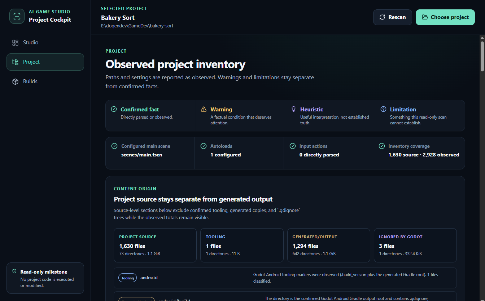

# Corrective Milestone 1 Handoff

**Date:** 2026-07-17

**Repository:** [doqendev/ai-game-studio](https://github.com/doqendev/ai-game-studio)

**Branch:** `internal-creator-prototype`

**Corrective implementation and evidence commit:** `dcb5cebf8c2bef53216721f337d8714870710320`

**Scope:** Milestone 1 corrections only

## Outcome

The independent audit's named Milestone 1 issues are corrected. The Project Cockpit remains read-only and retains only Studio, Project, and Builds as primary areas.

No Milestone 2 functionality was added. There is no Codex integration, Godot execution, build creation or launch, project snapshot, restore, version promotion, agent-role orchestration, daemon, MCP server, database, local HTTP API, or generic workflow engine.

The Internal Creator Prototype reframing source remained untouched. Its SHA-256 after the correction is still `77B048E2377150B321DF7E50BD94C98CF4161140C19185D32FB0F13C7754BEF0`.

## Concise diff summary

- Added explicit `project-source`, `tooling`, `generated-output`, `ignored-by-godot`, and `unknown` origin totals.
- Added conservative marker-based classification for Godot Android tooling/output and respected `.gdignore` boundaries without following links.
- Removed generated and ignored copies from source-level scenes, scripts, capabilities, native content, large-file, unsupported-file, and missing-dependency counts while retaining honest observed totals.
- Restricted missing dependencies to literal GDScript `load()`/`preload()`, scene/resource external-resource fields, selected `project.godot` dependency fields, plugin scripts, and GDExtension/GDNative library assignments.
- Excluded templates, wildcards, directories, arbitrary quoted paths, output paths, unsupported config fields, duplicates, and generated copies from confirmed missing-dependency findings.
- Bound every scan terminal transition to an immutable generation and operation identity.
- Preserved `uid://` and unsupported main-scene values without converting them into false missing-path findings.
- Split portable fixture acceptance from explicit owner evidence capture.
- Corrected file-cap, plugin declaration, reparse-point, inventory-state, and truncated-filter wording.
- Added trust-modal focus entry/trapping/Escape/return behavior and live owner-note length feedback.
- Replaced the audit-affected evidence reports and screenshots and added the Bakery Sort Project screenshot.

## New and updated tests

`npm test` passes **28 of 28 tests across 3 files**.

New scanner coverage includes:

- `.gdignore` source separation;
- marker-confirmed Android tooling and generated output;
- generated scene, script, GDExtension, native, and executable copies not inflating source counts;
- no-follow behavior inside an ignored tree;
- supported static and structured missing dependencies;
- `%s`, `%02d`, wildcard, directory, arbitrary mention, output-path, and generated-reference exclusions;
- plugin script dependency versus arbitrary config `path=` output;
- duplicate references and the reporting cap;
- path, missing-path, `uid://`, and unknown main-scene values;
- exact file-count cap behavior.

New deterministic controller coverage includes:

- scan A cancelled by scan B;
- scan A invalidated by project selection;
- scan A invalidated by trust removal;
- late success from scan A;
- late failure from scan A;
- only the latest generation controlling the final snapshot.

Updated Electron coverage includes:

- temporary portable app data;
- visible project selection and trust flow;
- modal focus entry, Tab/Shift+Tab trap, Escape, and focus restoration;
- note limits and live counters;
- origin separation in Project;
- Studio/Project/Builds navigation;
- truthful empty Builds state;
- rescan and trust removal.

## Portable acceptance result

Command:

```powershell
cd app
npm run test:acceptance
```

Result: **1 passed** in the final run. The suite uses only the controlled fixture, an OS-temporary application-data directory, and Playwright's temporary output. It contains no owner-specific filesystem path.

## Owner real-project evidence command and result

Command:

```powershell
cd app
$env:STUDIO_OWNER_PROJECT='E:\doqendev\GameDev\bakery-sort'
$env:STUDIO_OWNER_APP_DATA='C:\Users\Marcos\AppData\Local\AI Game Studio\Milestone1CorrectiveAcceptanceFinal'
$env:STUDIO_EVIDENCE_ROOT='E:\doqendev\AI Game Studio\docs\evidence\milestone1'
npm run test:owner-evidence
```

Result: **2 passed** in the final run: corrected controlled-fixture capture and Bakery Sort Studio/Project capture. When the three variables are absent, the two owner-evidence tests explicitly skip and do not affect portable acceptance.

## Updated controlled-fixture scan

[controlled-fixture-scan.json](../evidence/milestone1/controlled-fixture-scan.json) is a complete schema-2 scan:

- 23 observed files;
- 13 project-source;
- 1 tooling;
- 7 generated/output;
- 2 ignored by Godot;
- 2 source scenes and 2 source scripts;
- 1 deliberate concrete missing dependency;
- 7 confirmed facts, 7 warnings, 0 heuristics, and 5 limitations.

## Updated Bakery Sort scan

[real-project-scan.json](../evidence/milestone1/real-project-scan.json) is a complete schema-2 scan:

- 2,928 observed files;
- 1,630 project-source;
- 1 tooling;
- 1,294 generated/output;
- 3 ignored by Godot;
- 3 source scenes and 24 source GDScript files;
- 1 source GDExtension declaration, 2 source native-library files, and 4 source executable/command files;
- 0 confirmed missing local file dependencies;
- 5 large source files and 25 unsupported source files;
- 7 confirmed facts, 7 warnings, 0 heuristics, and 6 limitations.

The previous 13 false missing-resource findings and generated-copy inflation are absent.

## Before/after integrity

[Before](../evidence/milestone1/real-project-before.json) and [after](../evidence/milestone1/real-project-after.json) bracket the final explicit Bakery Sort evidence run. Both contain:

- 5,928 files;
- 2,682,293,420 bytes;
- no runtime-observed links or unreadable paths in the integrity walk;
- tree SHA-256 `5b72fca64e47268a94bf970a0c9a1a54ca570ae94612327d5c1f5601c0bb0bde`.

Bakery Sort remained byte-for-byte unchanged during the acceptance trial.

## Evidence index

[index.json](../evidence/milestone1/index.json) records 12 evidence artifacts with byte sizes and SHA-256 values. A fresh verification returned **0 mismatches**.

The full evidence explanation and exact boundaries are in [the corrective evidence README](../evidence/milestone1/README.md). Test commands and assertions are in [test-results.json](../evidence/milestone1/test-results.json).

## Updated screenshots

### Controlled fixture — Studio


### Controlled fixture — Project


### Controlled fixture — Builds


### Bakery Sort — Studio


### Bakery Sort — Project



## Final recommendation

**Accept corrected Milestone 1.**
