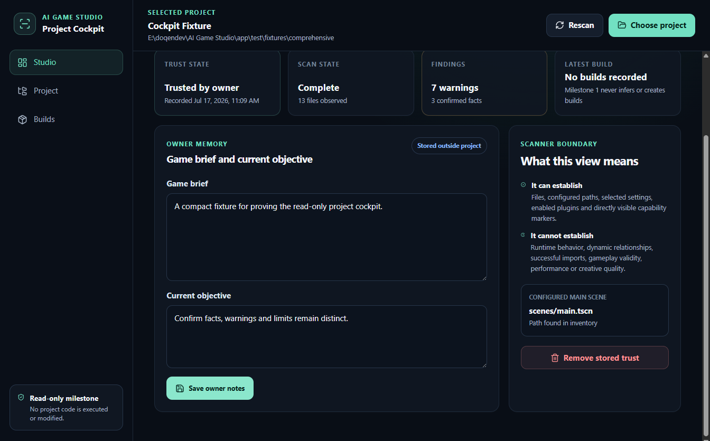
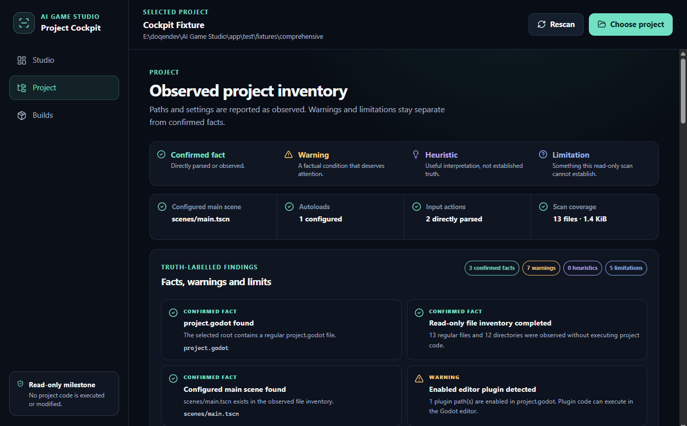
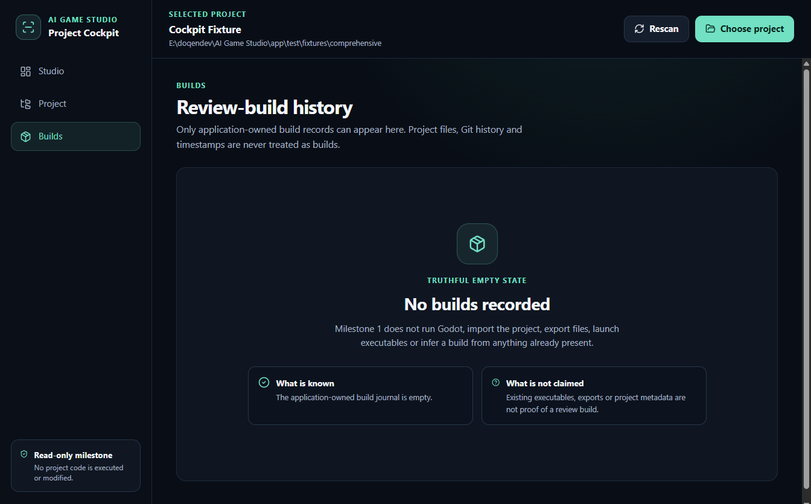

# AI Game Studio — Milestone 1 Professional Developer Handoff

- **Date:** 17 July 2026
- **Milestone:** Milestone 1 — Read-Only Project Cockpit
- **Repository:** `E:\doqendev\AI Game Studio`
- **Branch:** `internal-creator-prototype`
- **Milestone 1 commit:** `91481ffb42c0b0d4ab8f6442a6813881ec87aa53`
- **Accepted Milestone 0 baseline:** `9fe78b874f8eef72721c71db73337203ef9b1e8f`
**Milestone 0 tag:** `milestone-0-controlled-reset`

## Purpose of this handoff

Milestone 1 was authorized to answer one product question:

> Can the application give the owner a useful, honest, and understandable view of an existing trusted Godot project without requiring the Godot editor, Codex, Git, or a terminal during the project-review flow?

The implemented result answers that question positively within the limits described below.

This handoff requests an independent technical review of the implementation and evidence. It does not request or authorize Milestone 2, Codex integration, Godot execution, build production, snapshots, or version promotion.

## Delivered product surface

The Electron application contains exactly three primary areas:

1. **Studio**
   - Project name and canonical location.
   - Stored trust state.
   - Owner-editable game brief and current objective.
   - Scan state and finding counts.
   - Configured main scene.
   - Truthful latest-build state.
   - Plain-language explanation of what the scanner can and cannot establish.

2. **Project**
   - Configured main scene.
   - Scenes and GDScript files.
   - Images, audio, fonts, and other recognised asset groups.
   - Autoloads and input actions.
   - Selected display and rendering settings.
   - Enabled editor plugins.
   - GDExtension declarations and native libraries.
   - Executable or active content markers.
   - Missing directly quoted local references.
   - Unreadable, malformed, large, unsupported, and unusual filesystem entries.
   - Explicit scanner limitations.

3. **Builds**
   - Displays **No builds recorded**.
   - Does not infer builds from executables, project files, timestamps, Godot metadata, or Git history.

## Architecture delivered

```text
app/
├── src/
│   ├── main/
│   │   ├── main.ts
│   │   ├── scanner.ts
│   │   ├── state-store.ts
│   │   └── studio-controller.ts
│   ├── preload/
│   │   └── preload.ts
│   ├── renderer/
│   │   ├── App.tsx
│   │   ├── styles.css
│   │   └── index.html
│   └── shared/
│       └── contracts.ts
├── test/
│   ├── fixtures/
│   ├── scanner.test.ts
│   └── state-store.test.ts
├── acceptance/
│   └── cockpit.spec.ts
├── scripts/
│   ├── scan-project.ts
│   ├── project-integrity.ts
│   └── support/integrity.ts
├── package.json
└── README.md
```

The implementation introduces no daemon, local HTTP API, database, MCP server, workflow engine, role orchestration, Godot process integration, or extracted Gate 0 runtime modules.

## Read-only and Electron boundaries

The application may read the selected project. It stores trust decisions and owner notes in Electron application data, outside the project.

The project scanner uses:

- Canonical root resolution.
- `lstat`-based no-follow traversal.
- Reparse-point and junction detection.
- File-count, directory-depth, text-read, large-file, and displayed-list limits.
- Cancellation checkpoints.
- Explicit skipping of `.git`, `.godot`, and `.import` directories.
- No project code execution.
- No Godot execution.
- No project writes.

The Electron window uses:

- `contextIsolation: true`.
- `nodeIntegration: false`.
- Renderer sandboxing.
- Web security.
- A narrow typed preload bridge containing seven purpose-specific operations.
- Main-frame, sender, and local-origin validation for IPC.
- Denied permission requests.
- Blocked external navigation and new windows.
- A restrictive local Content Security Policy with `connect-src 'none'`.
- No remote web content.

The Electron choices are based on the current official documentation:

- [Electron security guidance](https://www.electronjs.org/docs/latest/tutorial/security)
- [Context isolation](https://www.electronjs.org/docs/latest/tutorial/context-isolation)
- [Process sandboxing](https://www.electronjs.org/docs/latest/tutorial/sandbox/)
- [Context bridge](https://www.electronjs.org/docs/latest/api/context-bridge)
- [Dialog API](https://www.electronjs.org/docs/latest/api/dialog)

These measures reduce Milestone 1 renderer and filesystem exposure. They are not presented as containment for a future code-executing milestone.

## Verification results

| Check | Result |
|---|---:|
| TypeScript checks | Passed |
| Scanner and state tests | 16 of 16 passed |
| Electron acceptance flows | 2 of 2 passed |
| Production build | Passed |
| Dependency audit | 0 vulnerabilities reported |
| Evidence index verification | 11 files, 0 mismatches |
| Final Git working tree | Clean |

The Electron acceptance flow exercised:

- The visible **Choose project** action using a controlled dialog response.
- First-open trust review.
- Trust cancellation.
- Trust recording.
- Trust removal and re-entry.
- Rescan from the visible control.
- Studio, Project, and Builds navigation.
- Editing and saving the game brief and current objective.
- The renderer boundary: no `require` or `process` global.
- The exact seven-method preload projection.
- The truthful empty build state.

Generated dependencies and outputs remain excluded from Git:

- `node_modules/`
- `dist/`
- `test-results/`
- build, release, coverage, and temporary output lanes

## Controlled fixture result

The controlled fixture scan completed successfully:

| Observation | Result |
|---|---:|
| Files | 13 |
| Directories | 12 |
| Scenes | 2 |
| GDScript files | 2 |
| Images | 1 |
| Audio files | 1 |
| Fonts | 1 |
| Autoloads | 1 |
| Input actions | 2 |
| Confirmed facts | 3 |
| Warnings | 7 |
| Heuristics | 0 |
| Limitations | 5 |

The fixture deliberately exercises an enabled plugin, GDExtension, native library, command file, active-content markers, a missing directly quoted resource reference, and an unsupported extension.

The broader test suite also covers:

- A minimal valid Godot project.
- Missing `project.godot`.
- Missing configured main scene.
- Malformed `project.godot`.
- Multiple scenes and scripts.
- Passive asset groups.
- Autoload and input parsing.
- Large and unsupported files.
- Injected unreadable-file behavior.
- Junction no-follow behavior.
- Deep directory limits.
- Scan cancellation.
- Rescan after project changes.
- Project integrity before and after scanning.

## Real owner-project result

The real acceptance project was:

`E:\doqendev\GameDev\bakery-sort`

The conservative scan reported:

| Observation | Result |
|---|---:|
| Project name | Bakery Sort |
| Configured main scene | `scenes/main.tscn` |
| Observed files | 2,928 |
| Observed directories | 717 |
| Scenes | 4 |
| GDScript files | 29 |
| Images | 788 |
| Audio files | 129 |
| Fonts | 1 |
| Autoloads | 1 |
| Enabled plugins | 1 |
| GDExtension declarations | 3 |
| Native libraries | 22 |
| Executable or command files | 6 |
| Confirmed facts | 3 |
| Warnings | 8 |
| Heuristics | 0 |
| Limitations | 6 |

The warnings include:

- Enabled editor plugin content.
- GDExtension declarations.
- Native-library content.
- Executable or command content.
- Directly observable active-content markers.
- 13 directly quoted local references not matched in the observed inventory.
- 17 large files.
- 312 files with extensions the scanner does not interpret.

These warnings identify observable conditions that deserve attention. They do not prove that the project is defective, unsafe, invalid, or unable to run.

## Byte-for-byte no-write evidence

Whole-tree integrity records were captured immediately before and after the final Bakery Sort Electron acceptance trial.

Both records contain:

| Integrity field | Value |
|---|---:|
| Files | 5,928 |
| Total bytes | 2,682,295,957 |
| Reparse points encountered | 0 |
| Unreadable paths | 0 |
| Tree SHA-256 | `fc5114c819a8f9e5c090ecdcf2aa17bcd4335136c9674e3b7cac64c1829852ad` |

The matching records establish that the selected Godot project remained byte-for-byte unchanged during the final acceptance trial.

## Application-owned data

The final acceptance profiles were written outside the selected projects under:

`C:\Users\Marcos\AppData\Local\AI Game Studio\Milestone1Acceptance\`

Functional application state:

- `fixture\studio-state.json`
- `bakery-sort\studio-state.json`

These files contain the selected-project pointer, canonical project identity, trust timestamp, game brief, and current objective. Electron also created its normal Chromium profile, cache, preferences, and session files under the same application-data roots.

No application state or scan cache was written into either selected Godot project.

## Evidence packet

The complete evidence packet is located at:

`docs/evidence/milestone1/`

Important files:

- `README.md` — human-readable evidence summary.
- `index.json` — machine-readable file sizes and SHA-256 values.
- `test-results.json` — commands, results, and acceptance assertions.
- `controlled-fixture-scan.json` — controlled scan report.
- `real-project-scan.json` — Bakery Sort scan report.
- `real-project-before.json` — pre-trial integrity record.
- `real-project-after.json` — post-trial integrity record.
- `app-data-inventory.json` — application-data inventory and state hashes.
- `screenshots/` — Studio, Project, Builds, and real-project screenshots.

## Owner-visible screenshots

### Studio — controlled fixture



### Project — controlled fixture



### Builds — truthful empty state



### Studio — Bakery Sort


## Known limitations and open review points

1. The `project.godot` reader is deliberately narrow and line-oriented. It is not a complete Godot configuration parser.
2. Missing-reference checks cover directly quoted local `res://` paths. Dynamic, computed, and runtime-created paths may remain invisible.
3. Native, executable, and asset classifications are conservative extension/declaration checks, not binary analysis.
4. `.git`, `.godot`, and `.import` directories are intentionally excluded from the product inventory.
5. Display lists are capped at 300 items per group while retaining total counts.
6. Reproducible unreadable-file behavior is tested through injected filesystem behavior because Windows ACL denial is environment-dependent.
7. The acceptance suite controls the native-dialog response; it does not automate the Windows Explorer dialog itself.
8. This is a development Electron shell, not a packaged installer.
9. Godot was never run. The evidence does not establish imports, launch success, gameplay, performance, runtime relationships, validity, fun, feel, balance, visual quality, or creative acceptance.
10. The scanner's warning classifications should be reviewed for useful signal versus noise before a later milestone expands project analysis.

## Explicitly not implemented

Milestone 1 contains no:

- Codex App Server or authentication.
- Producer, Designer, Builder, Reviewer, or Playtester roles.
- Prompt execution or agent summaries.
- Godot import, validation, testing, export, or launch.
- Build production or playable review runtime.
- Snapshots, restore, version promotion, or current-version selection.
- Git product workflow.
- Job Object integration.
- Hyper-V or containment probes.
- Daemon, local HTTP API, MCP server, database, plugin framework, or generic workflow engine.

## Requested professional-developer response

Please inspect the implementation and evidence rather than relying only on this summary. In particular, review:

- Whether the scanner's no-follow and canonical-path behavior is sufficient for this owner-only, read-only milestone.
- Whether any IPC or renderer boundary is broader than necessary.
- Whether warnings are factually phrased and clearly separate from limitations and heuristics.
- Whether the real-project scan result is useful enough to justify proceeding.
- Whether any identified issue must be corrected before later Codex or Godot-execution milestones begin.

Please finish the review with exactly one decision:

1. **Accept Milestone 1.**
2. **Revise named Milestone 1 issues.**
3. **Stop or materially change direction.**

Milestone 2 and Codex integration remain blocked until the owner explicitly accepts Milestone 1 and separately authorizes the next milestone.

## Implementation position

Based on the completed tests and evidence, the implementation position is:

**Accept Milestone 1.**
